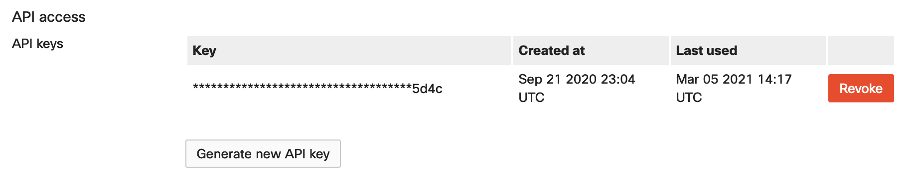

Meraki Config Output for Splunk
-------------------------------------

A quick script developed to structure and output Meraki Dashboard REST API into a format understood by Splunk


## Contacts
* Alexander Hoecht

## Solution Components
* Python 3 [Download latest version](https://www.python.org/downloads/)
* [Pandas](https://pandas.pydata.org/)

## STEP 1) Installation/Configuration
Steps needed to install and configure the project's environment
```
# Create a Virtual Environment
python3 -m venv Virtual_Environment

# Activate Virtual Environment
source Virtual_Environment/bin/activate # (MacOS)
Virtual_Environment/Scripts/activate # (Windows)

# Install Dependencies
pip install -r requirements.txt
```

## STEP 2) Retrieve your Meraki API Key
Generate / Retrieve your Meraki API from the Meraki Dashboard



## STEP 3) Starting the Application
Start the App, and follow the prompts:
```
python3 main.py
```


### LICENSE

Provided under Cisco Sample Code License, for details see [LICENSE](LICENSE.md)

### CODE_OF_CONDUCT

Our code of conduct is available [here](CODE_OF_CONDUCT.md)

### CONTRIBUTING

See our contributing guidelines [here](CONTRIBUTING.md)

#### DISCLAIMER:
<b>Please note:</b> This script is meant for demo purposes only. All tools/ scripts in this repo are released for use "AS IS" without any warranties of any kind, including, but not limited to their installation, use, or performance. Any use of these scripts and tools is at your own risk. There is no guarantee that they have been through thorough testing in a comparable environment and we are not responsible for any damage or data loss incurred with their use.
You are responsible for reviewing and testing any scripts you run thoroughly before use in any non-testing environment.